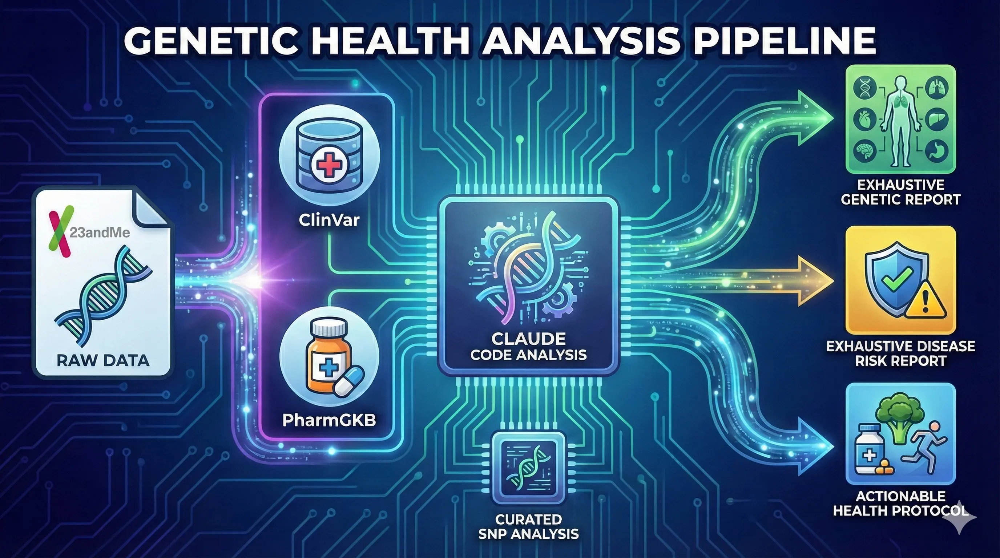

# Genetic Health Analysis Pipeline


A comprehensive genetic health analysis pipeline that processes 23andMe raw data to generate detailed health reports using Claude Code.

<br clear="all" />



## Attribution

This project is derived from work by **Nick Saraev**, originally demonstrated in:

**"I gave an AI my DNA and let it analyze my entire genome"**
YouTube: https://youtu.be/O1ICQworLVc

The original concept uses Claude Code to analyze 23andMe genetic data against ClinVar and PharmGKB databases to generate personalized health reports.

---

## Quick Start

### Prerequisites

1. **Install `uv` (Fastest Python Manager):**
   ```bash
   # On macOS and Linux
   curl -LsSf https://astral.sh/uv/install.sh | sh

   # On Windows
   powershell -c "irm https://astral.sh/uv/install.ps1 | iex"
   ```

2. **Get your 23andMe raw data:**
   - Log into 23andMe → Settings → Download Raw Data
   - Save as `data/genome.txt`

### Running with UV (Recommended)

The ClinVar database (`data/clinvar_alleles.tsv.gz`) will be automatically decompressed on first run.

```bash
# Basic run (pure Python, no extra dependencies)
uv run python scripts/run_full_analysis.py

# With fast mode (5-10x speedup using polars)
uv sync --extra fast
uv run python scripts/run_full_analysis.py

# With custom genome file and subject name
uv run python scripts/run_full_analysis.py data/genome.txt --name "Your Name"
```

### Running with Traditional Python

```bash
# Ensure Python 3.10+
python scripts/run_full_analysis.py

# Optional: Install polars for faster processing
pip install polars
python scripts/run_full_analysis.py --name "Your Name"
```

---

## What It Analyzes

Beyond the full ClinVar database scan (341,000+ clinically annotated variants), the pipeline includes two hand-curated SNP databases covering the most actionable, well-researched genetic variants.

### Comprehensive Health SNPs (88 variants)

Used by the main pipeline (`run_full_analysis.py`) for the detailed health report.

| Category | SNPs | Genes | Genes Covered |
|----------|------|-------|---------------|
| Drug Metabolism | 12 | 10 | CYP1A2, CYP2C19, CYP2C9, CYP2D6, CYP3A5, DPYD, HLA-B, SLCO1B1, TPMT, VKORC1 |
| Nutrition | 9 | 9 | APOA2, BCMO1, FADS1, FTO, FUT2, GC, MCM6/LCT, PPARG, TCF7L2 |
| Cardiovascular | 9 | 8 | ACE, ADRB1, AGT, AGTR1, APOE, F2, F5, GNB3 |
| Fitness | 8 | 8 | ACE, ACTN3, ADRB2, ADRB3, COL1A1, COL5A1, PPARA, PPARGC1A |
| Methylation | 6 | 5 | CBS, MTHFR, MTR, MTRR, PEMT |
| Neurotransmitters | 6 | 5 | ANKK1/DRD2, BDNF, COMT, OPRM1, SLC6A4 |
| Detoxification | 5 | 3 | GSTP1, NAT2, SOD2 |
| Sleep/Circadian | 4 | 4 | ARNTL, CLOCK, MTNR1B, PER2 |
| Skin | 4 | 2 | IRF4, MC1R |
| Mental Health | 4 | 4 | CACNA1C, FKBP5, HTR2A, MIR137 |
| Caffeine Response | 3 | 2 | ADA, ADORA2A |
| Autoimmune | 3 | 3 | HLA-DQA1, PTPN22, STAT4 |
| Longevity | 3 | 3 | CETP, FOXO3, TP53 |
| Inflammation | 2 | 2 | IL6, TNF |
| Iron Metabolism | 2 | 1 | HFE |
| Alcohol | 2 | 2 | ADH1B, ALDH2 |
| Hormone Regulation | 2 | 2 | CYP19A1, FSHR |
| Bone Health | 2 | 2 | ESR1, LRP5 |
| Respiratory | 1 | 1 | SERPINA1 |
| Cancer Predisposition | 1 | 1 | CHEK2 |

### Curated High-Impact SNPs (34 variants)

Used by `analyze_genome.py` for a focused report on the most critical/actionable findings.

| Category | SNPs | Genes | Genes Covered |
|----------|------|-------|---------------|
| Drug Metabolism | 13 | 10 | CYP1A2, CYP2C19, CYP2C9, CYP2D6, CYP3A5, DPYD, HLA-B, SLCO1B1, TPMT, VKORC1 |
| Detoxification | 3 | 2 | GSTP1, NAT2 |
| Caffeine Response | 2 | 1 | ADORA2A |
| Cardiovascular/Neuro | 2 | 1 | APOE |
| Blood Clotting | 2 | 2 | F2, F5 |
| Methylation | 2 | 1 | MTHFR |
| Nutrition | 2 | 2 | GC, MCM6/LCT |
| Iron Metabolism | 2 | 1 | HFE |
| Neurotransmitters | 1 | 1 | COMT |
| Autoimmune | 1 | 1 | HLA-DQA1 |
| Cancer Risk | 1 | 1 | BRCA1 |
| Drug Safety | 1 | 1 | G6PD |
| Lung/Liver | 1 | 1 | SERPINA1 |
| Metabolism | 1 | 1 | FTO |

### ClinVar Database Scan

In addition to the curated SNPs above, the pipeline scans your entire genome against the **ClinVar database** (341,000+ variants) to find pathogenic/likely pathogenic variants, risk factors, drug responses, and protective variants. This catches rare or newly classified variants that aren't in the curated lists.

---

## Output Reports

The pipeline generates three reports in `reports/`:

| Report | Description |
|--------|-------------|
| `EXHAUSTIVE_GENETIC_REPORT.md` | Drug metabolism, methylation, nutrition, fitness, cardiovascular, sleep genetics |
| `EXHAUSTIVE_DISEASE_RISK_REPORT.md` | Pathogenic variants, carrier status, risk factors from ClinVar |
| `ACTIONABLE_HEALTH_PROTOCOL_V3.md` | Personalized supplements, diet, exercise, monitoring recommendations |

---

## Project Structure

```
analyze-dna/
├── README.md                  # This file
├── CLAUDE.md                  # Instructions for Claude Code
├── pyproject.toml             # UV/pip package configuration
├── data/
│   ├── genome.txt             # Your 23andMe raw data (add this)
│   ├── clinvar_alleles.tsv.gz # ClinVar database (auto-extracted on run)
│   └── clinical_*.tsv         # PharmGKB data (included)
├── scripts/
│   ├── run_full_analysis.py   # Main entry point
│   ├── fast_loader.py         # Optimized loading (polars)
│   └── *.py                   # Analysis modules
└── reports/                   # Generated reports
```

---

## Performance

| Mode | ClinVar Processing | Install |
|------|-------------------|---------|
| Standard | ~15-25 seconds | No extra deps |
| Fast (polars) | ~2-4 seconds | `uv sync --extra fast` |

---

## Running for Multiple People

```bash
cp ~/Downloads/genome_mom.txt data/genome_mom.txt
uv run python scripts/run_full_analysis.py data/genome_mom.txt --name "Mom"

# Rename outputs to preserve
mv reports/EXHAUSTIVE_GENETIC_REPORT.md reports/EXHAUSTIVE_GENETIC_REPORT_MOM.md
```

---

## Data Sources

| File | Size | Included | Source |
|------|------|----------|--------|
| genome.txt | ~25MB | No | Your 23andMe download |
| clinvar_alleles.tsv.gz | ~60MB (zipped) | **Yes** | Included (auto-extracted to 289MB) |
| clinical_annotations.tsv | ~850KB | Yes | PharmGKB |
| clinical_ann_alleles.tsv | ~5.5MB | Yes | PharmGKB |

### Updating Data (Quarterly Recommended)

- **ClinVar**: https://ftp.ncbi.nlm.nih.gov/pub/clinvar/
- **PharmGKB**: https://www.pharmgkb.org/downloads (free account)

---

## Limitations

1. **Not a clinical diagnosis** - For informational purposes only
2. **Population differences** - Associations may vary by ancestry
3. **Incomplete penetrance** - Not everyone with variant develops condition
4. **Evolving science** - Classifications change as research progresses
5. **Indels not analyzed** - Only single nucleotide variants from 23andMe

---

## License

This analysis pipeline is for personal/educational use. Not for clinical or diagnostic purposes.

**Original concept by Nick Saraev** - https://youtu.be/O1ICQworLVc
